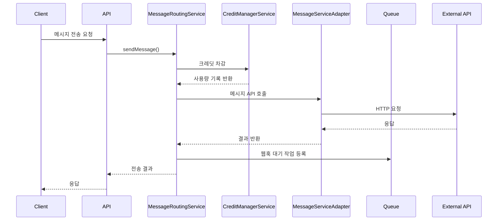
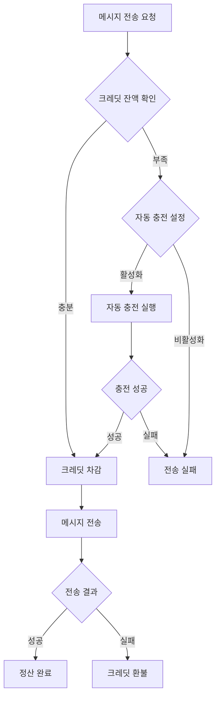

# Credit Messaging 시스템 아키텍처

## 개요

Credit Messaging 시스템은 Laravel 기반의 멀티테넌트 메시징 플랫폼으로, 크레딧 기반 과금, 스마트 라우팅, 자동 정산 기능을 제공하는 종합적인 메시징 솔루션입니다.

## 시스템 아키텍처

### 1. 레이어드 아키텍처 (Layered Architecture)

```
┌─────────────────────────────────────────────────────────────┐
│                    Presentation Layer                       │
│  - Orchid Admin Screens                                    │
│  - API Controllers                                          │
│  - Webhook Controllers                                      │
└─────────────────────────────────────────────────────────────┘
                                │
┌─────────────────────────────────────────────────────────────┐
│                     Service Layer                          │
│  - MessageRoutingService                                   │
│  - CreditManagerService                                    │
│  - MessageServiceAdapter                                   │
└─────────────────────────────────────────────────────────────┘
                                │
┌─────────────────────────────────────────────────────────────┐
│                    Domain Layer                             │
│  - CreditMessage (Entity)                                  │
│  - SiteCredit (Entity)                                     │
│  - SiteCreditUsage (Entity)                               │
│  - SiteCreditPayment (Entity)                             │
│  - MessageSendLog (Entity)                                │
└─────────────────────────────────────────────────────────────┘
                                │
┌─────────────────────────────────────────────────────────────┐
│                Infrastructure Layer                         │
│  - Database (MySQL/PostgreSQL)                            │
│  - Queue System (Redis/Database)                          │
│  - External APIs (Alimtalk, SMS, LMS, MMS)               │
│  - File Storage                                           │
└─────────────────────────────────────────────────────────────┘
```

### 2. 핵심 컴포넌트

#### 2.1 Service Layer

##### MessageRoutingService
- **역할**: 메시지 라우팅 전략 실행 및 전송 관리
- **주요 기능**:
  - 라우팅 전략별 메시지 전송 (`alimtalk_first`, `sms_only`, `cost_optimized`)
  - 수신자 유효성 검증
  - 비용 계산 및 최적화
  - 예약 메시지 관리

```php
class MessageRoutingService
{
    private MessageServiceAdapter $messageAdapter;
    private CreditManagerService $creditManager;

    public function sendMessage(CreditMessage $creditMessage): array
    public function scheduleMessage(CreditMessage $creditMessage): void
    public function estimateMessageCost(string $siteId, string $messageType, int $recipientCount, string $content = null): array
}
```

##### CreditManagerService
- **역할**: 크레딧 관리 및 과금 처리
- **주요 기능**:
  - 사이트별 크레딧 관리
  - 자동 충전 처리
  - 사용량 추적 및 환불
  - 통계 생성

```php
class CreditManagerService
{
    public function getSiteCredit(string $siteId): SiteCredit
    public function chargeCredits(string $siteId, string $messageType, int $quantity): SiteCreditUsage
    public function refundCredits(SiteCreditUsage $usage, float $amount, string $reason): bool
    public function addPayment(string $siteId, float $amount, string $method, array $data = []): SiteCreditPayment
}
```

##### MessageServiceAdapter
- **역할**: 외부 메시지 서비스 API 통합
- **주요 기능**:
  - 다중 메시지 서비스 제공업체 지원
  - API 호출 추상화
  - 에러 처리 및 재시도
  - 웹훅 처리

```php
class MessageServiceAdapter
{
    public function sendAlimtalk(string $siteId, array $recipients, string $templateCode, array $templateData = []): array
    public function sendSms(string $siteId, array $recipients, string $message, string $senderId = null): array
    public function sendLms(string $siteId, array $recipients, string $subject, string $message, string $senderId = null): array
    public function sendMms(string $siteId, array $recipients, string $subject, string $message, array $attachments = [], string $senderId = null): array
}
```

#### 2.2 Domain Layer

##### 핵심 엔티티

```php
// 메시지 캠페인 및 전송 관리
class CreditMessage extends DynamicModel
{
    protected $casts = [
        'recipients' => 'array',
        'scheduled_at' => 'datetime',
        'sent_at' => 'datetime',
        'estimated_cost' => 'decimal:2',
        'actual_cost' => 'decimal:2',
    ];
}

// 사이트별 크레딧 잔액 및 설정
class SiteCredit extends DynamicModel
{
    protected $casts = [
        'balance' => 'decimal:2',
        'alimtalk_cost' => 'decimal:2',
        'sms_cost' => 'decimal:2',
        'lms_cost' => 'decimal:2',
        'mms_cost' => 'decimal:2',
        'auto_charge_enabled' => 'boolean',
    ];
}

// 크레딧 사용 내역
class SiteCreditUsage extends DynamicModel
{
    protected $casts = [
        'quantity' => 'integer',
        'cost_per_unit' => 'decimal:2',
        'total_cost' => 'decimal:2',
        'refund_amount' => 'decimal:2',
    ];
}
```

### 3. 데이터 흐름 (Data Flow)

#### 3.1 메시지 전송 프로세스



#### 3.2 크레딧 관리 프로세스



### 4. 메시지 라우팅 전략

#### 4.1 Alimtalk First 전략

```php
private function sendWithAlimtalkFirst(CreditMessage $creditMessage, array $recipients): array
{
    try {
        // 1. 알림톡 전송 시도
        if (isset($metadata['alimtalk_template_code'])) {
            $alimtalkResult = $this->messageAdapter->sendAlimtalk(
                $siteId,
                $recipients,
                $metadata['alimtalk_template_code'],
                $metadata['alimtalk_template_data'] ?? []
            );
            return $alimtalkResult;
        }
    } catch (\Exception $e) {
        Log::warning("알림톡 전송 실패, SMS로 폴백");
    }

    // 2. SMS 폴백
    $smsResult = $this->messageAdapter->sendSms($siteId, $recipients, $content);
    return $smsResult;
}
```

#### 4.2 Cost Optimized 전략

```php
private function sendCostOptimized(CreditMessage $creditMessage, array $recipients): array
{
    $siteCredit = $this->creditManager->getSiteCredit($siteId);
    
    // 비용 비교
    $alimtalkCost = $siteCredit->getCostForMessageType('alimtalk') * count($recipients);
    $smsCost = $this->calculateSmsCost($content, count($recipients), $siteCredit);
    
    // 더 저렴한 방법 선택
    if ($alimtalkCost <= $smsCost) {
        return $this->sendWithAlimtalkFirst($creditMessage, $recipients);
    } else {
        return $this->sendSmsOnly($creditMessage, $recipients);
    }
}
```

### 5. 큐 시스템 아키텍처

#### 5.1 큐 구조

```
┌─────────────────────────────────────────────────────────────┐
│                     Queue System                           │
│                                                             │
│  ┌─────────────────┐  ┌─────────────────┐  ┌─────────────┐ │
│  │  default queue  │  │ credit-messaging│  │ webhooks    │ │
│  │                 │  │     queue       │  │   queue     │ │
│  │ - 일반 작업      │  │ - 예약 메시지    │  │ - 웹훅 처리  │ │
│  │                 │  │ - 대량 발송     │  │ - 결과 처리  │ │
│  └─────────────────┘  └─────────────────┘  └─────────────┘ │
└─────────────────────────────────────────────────────────────┘
```

#### 5.2 예약 메시지 처리

```php
class SendScheduledMessageJob implements ShouldQueue
{
    use Dispatchable, InteractsWithQueue, Queueable, SerializesModels;

    public function handle(): void
    {
        // 1. 메시지 상태 확인
        if (!$this->creditMessage->isScheduled()) {
            return;
        }

        // 2. 메시지 전송
        $result = MessageRouter::sendMessage($this->creditMessage);

        // 3. 결과 로깅
        Log::info('예약 메시지 전송 완료', [
            'message_id' => $this->creditMessage->id,
            'result' => $result
        ]);
    }
}
```

### 6. 보안 아키텍처

#### 6.1 웹훅 보안

```php
class WebhookController extends Controller
{
    public function handle(Request $request, string $provider): JsonResponse
    {
        // 1. 서명 검증
        if (!$this->validateWebhookSignature($request, $provider)) {
            return response()->json(['error' => 'Invalid signature'], 401);
        }

        // 2. IP 화이트리스트 확인
        if (!$this->isAllowedIP($request->ip(), $provider)) {
            return response()->json(['error' => 'Unauthorized IP'], 403);
        }

        // 3. 웹훅 처리
        $result = MessageRouter::processWebhook($provider, $request->all());
        
        return response()->json(['status' => 'success', 'data' => $result]);
    }
}
```

#### 6.2 API 보안

- **인증**: Laravel Sanctum 토큰 기반 인증
- **권한**: Spatie Laravel Permission 패키지 활용
- **요율 제한**: Laravel 내장 throttle 미들웨어
- **CORS**: 설정 가능한 CORS 정책

### 7. 확장성 고려사항

#### 7.1 수평 확장 (Horizontal Scaling)

```php
// 로드밸런서를 통한 다중 서버 구성
'queue' => [
    'default' => 'redis',
    'connections' => [
        'redis' => [
            'driver' => 'redis',
            'connection' => 'default',
            'queue' => env('REDIS_QUEUE', 'default'),
            'retry_after' => 90,
            'block_for' => null,
        ],
    ],
],
```

#### 7.2 데이터베이스 샤딩

```php
// 사이트 ID 기반 샤딩 전략
class DatabaseShardingService
{
    public function getConnectionForSite(string $siteId): string
    {
        $shardNumber = crc32($siteId) % config('database.shard_count');
        return "mysql_shard_{$shardNumber}";
    }
}
```

### 8. 모니터링 및 로깅

#### 8.1 로깅 전략

```php
// 구조화된 로깅
Log::info('메시지 전송 시작', [
    'context' => 'message_sending',
    'site_id' => $siteId,
    'message_id' => $messageId,
    'recipient_count' => count($recipients),
    'routing_strategy' => $strategy,
    'estimated_cost' => $estimatedCost
]);
```

#### 8.2 메트릭 수집

```php
// 비즈니스 메트릭
Metrics::increment('credit_messaging.messages_sent', [
    'site_id' => $siteId,
    'message_type' => $messageType,
    'routing_strategy' => $strategy
]);

Metrics::histogram('credit_messaging.message_cost', $cost, [
    'site_id' => $siteId,
    'message_type' => $messageType
]);
```

### 9. 성능 최적화

#### 9.1 캐싱 전략

```php
// 사이트 크레딧 정보 캐싱
public function getSiteCredit(string $siteId): SiteCredit
{
    return Cache::remember("site_credit:{$siteId}", 300, function () use ($siteId) {
        return SiteCredit::firstOrCreate(['site_id' => $siteId], $this->getDefaultCreditConfig());
    });
}
```

#### 9.2 데이터베이스 최적화

```sql
-- 인덱스 전략
CREATE INDEX idx_site_credits_site_id ON site_credits(site_id);
CREATE INDEX idx_credit_messages_site_status ON credit_messages(site_id, status);
CREATE INDEX idx_credit_messages_scheduled ON credit_messages(scheduled_at) WHERE status = 'scheduled';
CREATE INDEX idx_site_credit_usages_site_date ON site_credit_usages(site_id, created_at);
```

## 결론

Credit Messaging 시스템은 모듈러 아키텍처를 기반으로 높은 확장성과 유지보수성을 제공합니다. 레이어드 아키텍처를 통해 관심사를 분리하고, 서비스 레이어에서 비즈니스 로직을 캡슐화하여 재사용성을 높였습니다. 또한 큐 시스템을 활용한 비동기 처리와 종합적인 모니터링을 통해 안정적이고 확장 가능한 메시징 플랫폼을 구현했습니다. 