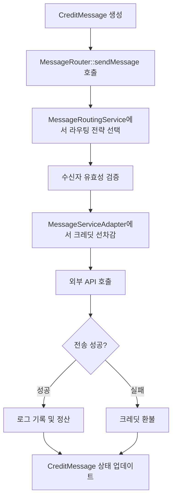
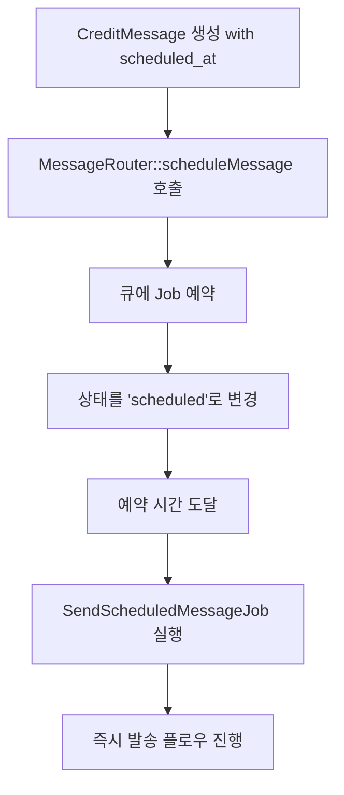

# Techigh Credit Messaging 패키지 아키텍처 문서

**언어 선택:** [English](#) | [한국어](ARCHITECTURE.md)

이 문서는 Techigh Credit Messaging 패키지의 전체 구조와 아키텍처를 설명합니다.

## 📁 전체 패키지 구조

```
packages/techigh/credit-messaging/
├── src/
│   ├── Models/               # 데이터 모델
│   │   ├── BaseModel.php     # 기본 모델 클래스
│   │   ├── SiteCredit.php    # 사이트 크레딧 모델
│   │   ├── CreditMessage.php # 크레딧 메시지 모델
│   │   ├── SiteCreditUsage.php # 크레딧 사용 기록
│   │   ├── SiteCreditPayment.php # 결제 기록
│   │   └── MessageSendLog.php # 메시지 발송 로그
│   ├── Services/            # 핵심 비즈니스 로직
│   │   ├── CreditManagerService.php # 크레딧 관리 서비스
│   │   ├── MessageServiceAdapter.php # 메시지 서비스 어댑터
│   │   └── MessageRoutingService.php # 메시지 라우팅 서비스
│   ├── Providers/           # Laravel 서비스 프로바이더
│   │   └── CreditMessagingServiceProvider.php
│   ├── Facades/             # Laravel Facade 클래스
│   │   ├── CreditManager.php
│   │   └── MessageRouter.php
│   ├── Http/                # 컨트롤러 및 미들웨어
│   │   └── Controllers/
│   ├── Jobs/                # 비동기 작업
│   └── Commands/            # Artisan 명령어
├── config/                  # 설정 파일
│   └── credit-messaging.php
├── database/                # 마이그레이션 및 시더
│   ├── migrations/
│   └── seeders/
├── routes/                  # API 라우트
│   └── api.php
├── README.md               # 영문 문서
├── README-ko.md            # 한글 문서
└── ARCHITECTURE.md         # 아키텍처 문서 (이 파일)
```

## 🔧 핵심 아키텍처 및 의존성 주입 흐름

### 1. ServiceProvider 등록 순서

`CreditMessagingServiceProvider`에서 서비스들이 등록되는 순서와 의존성:

```php
public function register(): void
{
    // 1. CreditManagerService (독립적, 가장 먼저 등록)
    $this->app->singleton(CreditManagerService::class, function () {
        return new CreditManagerService();
    });

    // 2. MessageServiceAdapter (CreditManagerService에 의존)
    $this->app->singleton(MessageServiceAdapter::class, function () {
        return new MessageServiceAdapter(app(CreditManagerService::class));
    });

    // 3. MessageRoutingService (MessageServiceAdapter + CreditManagerService에 의존)
    $this->app->singleton(MessageRoutingService::class, function () {
        return new MessageRoutingService(
            app(MessageServiceAdapter::class),
            app(CreditManagerService::class)
        );
    });

    // 4. Facade 바인딩
    $this->app->bind('credit-manager', function () {
        return app(CreditManagerService::class);
    });

    $this->app->bind('message-router', function () {
        return app(MessageRoutingService::class);
    });
}
```

### 2. 의존성 계층 구조

```
MessageRoutingService (최상위 - 메시지 라우팅 로직)
├── MessageServiceAdapter (외부 API 연동)
│   └── CreditManagerService (크레딧 관리)
│       └── CreditManagerService (공유 인스턴스)
└── CreditManagerService (공유 인스턴스)
```

**의존성 주입 흐름:**
1. `CreditManagerService` → 독립적으로 먼저 생성
2. `MessageServiceAdapter` → `CreditManagerService` 주입받아 생성
3. `MessageRoutingService` → `MessageServiceAdapter`와 `CreditManagerService` 모두 주입받아 생성

## 📊 데이터 모델 구조

### 핵심 모델들

#### 1. SiteCredit (사이트 크레딧)
- **역할**: 사이트별 크레딧 잔액 및 요금 설정 관리
- **주요 필드**: `site_id`, `balance`, `alimtalk_cost`, `sms_cost`, `lms_cost`, `mms_cost`
- **관계**: 다른 모든 모델의 기준점

#### 2. CreditMessage (크레딧 메시지)
- **역할**: 메시지 캠페인 및 템플릿 관리
- **주요 필드**: `site_id`, `message_content`, `routing_strategy`, `status`
- **상태**: `draft`, `scheduled`, `sending`, `completed`, `failed`, `cancelled`

#### 3. SiteCreditUsage (크레딧 사용 기록)
- **역할**: 크레딧 차감 및 환불 내역 추적
- **주요 필드**: `site_id`, `message_type`, `quantity`, `total_cost`, `refund_amount`

#### 4. SiteCreditPayment (결제 기록)
- **역할**: 크레딧 충전 및 결제 내역 관리
- **주요 필드**: `site_id`, `amount`, `payment_method`, `status`

#### 5. MessageSendLog (메시지 발송 로그)
- **역할**: 실제 메시지 발송 결과 및 정산 데이터
- **주요 필드**: `usage_id`, `message_ids`, `delivery_status`, `actual_cost`

### 모델 관계도

```
SiteCredit (1:N 관계)
├── SiteCreditUsage (크레딧 사용 기록)
│   └── MessageSendLog (발송 로그)
├── SiteCreditPayment (결제 기록)
└── CreditMessage (메시지 캠페인)
```

## 🚀 서비스 레이어 구조

### 1. CreditManagerService (핵심 크레딧 관리)

**주요 책임:**
- 사이트별 크레딧 잔액 조회/관리
- 메시지 유형별 요금 계산 및 차감
- 결제 처리 및 크레딧 충전
- 환불 처리 및 잔액 복구
- 자동 충전 로직 실행
- 기존 크레딧 시스템과의 연동

**핵심 메서드:**
```php
- getSiteCredit(string $siteId): SiteCredit
- getBalance(string $siteId): float
- chargeCredits(string $siteId, string $messageType, int $quantity): SiteCreditUsage
- refundCredits(SiteCreditUsage $usage, float $amount, string $reason): void
- addPayment(string $siteId, float $amount, string $method, array $data = []): SiteCreditPayment
- completePayment(SiteCreditPayment $payment): void
```

### 2. MessageServiceAdapter (외부 API 어댑터)

**주요 책임:**
- 외부 메시지 서비스 API와의 통신
- 알림톡/SMS/LMS/MMS 실제 발송
- 전송 전 크레딧 선차감 처리
- 전송 실패 시 자동 환불 처리
- 전송 결과 로깅 및 정산
- 메시지 상태 조회 및 추적

**핵심 메서드:**
```php
- sendAlimtalk(string $siteId, array $recipients, string $templateCode, array $templateData = []): array
- sendSms(string $siteId, array $recipients, string $message, ?string $senderId = null): array
- sendWithFallback(string $siteId, array $recipients, string $message, array $alimtalkOptions = []): array
- estimateCost(string $siteId, string $messageType, int $quantity): float
- preflightCheck(string $siteId, string $messageType, int $quantity): array
```

### 3. MessageRoutingService (메시지 라우팅 로직)

**주요 책임:**
- 라우팅 전략에 따른 메시지 발송 로직 실행
- 알림톡 우선 → SMS 폴백 처리
- 비용 최적화 라우팅 실행
- 예약 발송 관리 및 스케줄링
- 배치 상태 관리 및 추적
- 수신자 유효성 검증

**핵심 메서드:**
```php
- sendMessage(CreditMessage $creditMessage): array
- scheduleMessage(CreditMessage $creditMessage): void
- estimateMessageCost(string $siteId, string $messageType, int $recipientCount, string $content = ''): array
- getBatchStatus(string $batchId): array
- cancelScheduledMessage(CreditMessage $creditMessage): void
```

## 🔄 메시지 발송 플로우

### 1. 즉시 발송 플로우



### 2. 예약 발송 플로우



## 📱 라우팅 전략

### 1. `alimtalk_first`: 알림톡 우선 전략

```php
1. 알림톡 템플릿 코드 확인
2. 알림톡 발송 시도
3. 성공 시: 완료
4. 실패 시: SMS로 폴백 발송
```

**사용 사례:** 고객 알림, 마케팅 메시지 등 비용 효율성과 도달률을 모두 고려해야 하는 경우

### 2. `sms_only`: SMS 전용

```php
1. SMS/LMS/MMS 직접 발송 (메시지 길이에 따라 자동 분류)
2. 알림톡 시도 없음
```

**사용 사례:** 긴급 알림, 인증번호 등 즉시 전달이 중요한 경우

### 3. `cost_optimized`: 비용 최적화

```php
1. 알림톡 단가 계산 (알림톡 단가 × 수신자 수)
2. SMS 단가 계산 (SMS/LMS/MMS 단가 × 수신자 수)
3. 더 저렴한 방식 선택하여 발송
```

**사용 사례:** 대량 발송, 예산이 제한된 캠페인

## 🎛️ Facade 패턴 활용

### CreditManager Facade

Laravel의 Facade 패턴을 활용하여 간편한 API 제공:

```php
use Techigh\CreditMessaging\Facades\CreditManager;

// 크레딧 잔액 조회
$balance = CreditManager::getBalance('site_001');

// 크레딧 차감
$usage = CreditManager::chargeCredits('site_001', 'sms', 100);

// 사용량 통계
$stats = CreditManager::getUsageStats('site_001', $startDate, $endDate);
```

### MessageRouter Facade

```php
use Techigh\CreditMessaging\Facades\MessageRouter;

// 메시지 즉시 발송
$result = MessageRouter::sendMessage($creditMessage);

// 비용 예상
$estimation = MessageRouter::estimateMessageCost('site_001', 'sms', 100);

// 배치 상태 조회
$status = MessageRouter::getBatchStatus('batch_12345');
```

## ⚙️ 설정 관리

### 주요 설정 카테고리

#### 1. message_service (외부 API 연동 설정)
```php
'message_service' => [
    'base_url' => env('MESSAGE_SERVICE_BASE_URL'),
    'api_key' => env('MESSAGE_SERVICE_API_KEY'),
    'timeout' => env('MESSAGE_SERVICE_TIMEOUT', 30),
]
```

#### 2. default_costs (기본 단가 설정)
```php
'default_costs' => [
    'alimtalk' => env('DEFAULT_ALIMTALK_COST', 15.00),
    'sms' => env('DEFAULT_SMS_COST', 20.00),
    'lms' => env('DEFAULT_LMS_COST', 50.00),
    'mms' => env('DEFAULT_MMS_COST', 200.00),
]
```

#### 3. routing (라우팅 전략 설정)
```php
'routing' => [
    'default_strategy' => env('DEFAULT_ROUTING_STRATEGY', 'alimtalk_first'),
    'strategies' => [
        'alimtalk_first' => '알림톡 우선 (SMS 폴백)',
        'sms_only' => 'SMS 전용',
        'cost_optimized' => '비용 최적화',
    ],
]
```

#### 4. auto_charge (자동 충전 설정)
```php
'auto_charge' => [
    'enabled' => env('AUTO_CHARGE_ENABLED', false),
    'default_threshold' => env('AUTO_CHARGE_THRESHOLD', 10000.00),
    'default_amount' => env('AUTO_CHARGE_AMOUNT', 50000.00),
]
```

## 🔒 보안 및 인증

### 1. API 인증
- **Bearer Token**: HTTP 헤더를 통한 API 키 인증
- **Rate Limiting**: 분당 요청 수 제한
- **IP Whitelist**: 허용된 IP 주소에서만 접근 가능

### 2. 웹훅 보안
- **서명 검증**: 웹훅 페이로드의 무결성 검증
- **타임스탬프 검증**: 재생 공격 방지
- **HTTPS 강제**: 암호화된 통신만 허용

### 3. 데이터 보안
- **민감 정보 암호화**: 결제 정보 등 민감 데이터 암호화
- **접근 권한 제어**: 사이트별 데이터 격리
- **감사 로그**: 모든 중요 작업에 대한 로그 기록

## 📈 모니터링 및 로깅

### 1. 로깅 레벨
- **INFO**: 정상적인 메시지 발송 및 크레딧 변동
- **WARNING**: 알림톡 실패 후 SMS 폴백 등
- **ERROR**: API 오류, 결제 실패 등
- **DEBUG**: 개발 환경에서의 상세 디버깅 정보

### 2. 모니터링 지표
- **발송 성공률**: 메시지 유형별 전송 성공률
- **크레딧 사용량**: 시간대별/일별 크레딧 소비 패턴
- **API 응답시간**: 외부 서비스 성능 모니터링
- **에러 발생률**: 시스템 안정성 지표

### 3. 알림 및 경고
- **크레딧 부족 알림**: 설정된 임계값 이하로 잔액 감소 시
- **결제 실패 알림**: 자동 충전 실패 시
- **웹훅 실패 알림**: 전송 결과 수신 실패 시

## 🔄 확장성 고려사항

### 1. 수평 확장
- **큐 시스템**: Redis/Database 기반 큐를 통한 비동기 처리
- **캐싱**: 크레딧 정보 및 설정 캐싱으로 성능 향상
- **로드밸런싱**: 여러 인스턴스에서 동시 처리 가능

### 2. 새로운 메시지 서비스 추가
- **어댑터 패턴**: 새로운 서비스 제공업체 쉽게 추가 가능
- **통일된 인터페이스**: 일관된 API로 다양한 서비스 지원

### 3. 멀티테넌트 지원
- **사이트별 격리**: 각 사이트의 데이터 완전 분리
- **개별 설정**: 사이트별 독립적인 요금 및 설정 관리

---

이 아키텍처는 **확장성**, **유지보수성**, **성능**을 고려하여 설계되었으며, Laravel의 **의존성 주입 컨테이너**와 **Facade 패턴**을 활용한 깔끔하고 직관적인 API를 제공합니다. 