# Credit Messaging 시스템 프로세스 가이드

## 개요

이 문서는 Credit Messaging 시스템의 주요 비즈니스 프로세스와 워크플로우에 대해 설명합니다. 시스템의 전체적인 동작 흐름을 이해하고 각 단계별 처리 과정을 파악할 수 있도록 구성되었습니다.

## 1. 전체 시스템 프로세스 개요

### 1.1 메시지 생명주기 (Message Lifecycle)

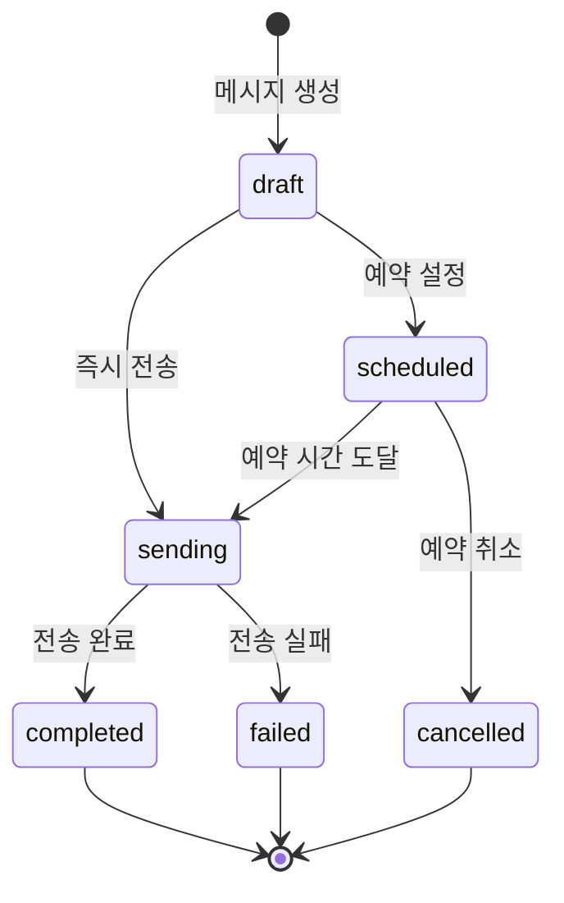

### 1.2 크레딧 프로세스 흐름

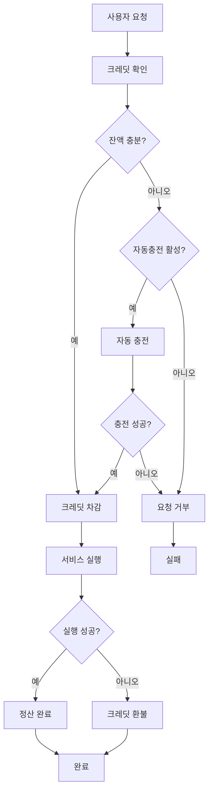

## 2. 메시지 전송 프로세스

### 2.1 메시지 생성 및 설정

#### 단계별 프로세스:

1. **메시지 기본 정보 입력**
   ```php
   $creditMessage = CreditMessage::create([
       'site_id' => 'site_001',
       'title' => '마케팅 캠페인',
       'message_content' => '할인 이벤트 안내',
       'message_type' => 'alimtalk',
       'routing_strategy' => 'alimtalk_first',
       'status' => 'draft'
   ]);
   ```

2. **수신자 설정 및 검증**
   ```php
   $creditMessage->recipients = ['01012345678', '01087654321'];
   $validRecipients = $this->validateRecipients($creditMessage->recipients);
   ```

3. **메타데이터 설정 (알림톡 템플릿, 발신번호 등)**
   ```php
   $creditMessage->metadata = [
       'alimtalk_template_code' => 'MARKETING_001',
       'alimtalk_template_data' => [
           '#{상품명}' => '특가 상품',
           '#{할인율}' => '50%'
       ],
       'sender_id' => '1588-1234'
   ];
   ```

### 2.2 비용 추정 및 검증

#### 프로세스:

1. **메시지 타입별 비용 계산**
   ```php
   public function estimateMessageCost(string $siteId, string $messageType, int $recipientCount): array
   {
       $siteCredit = $this->creditManager->getSiteCredit($siteId);
       $costPerUnit = $siteCredit->getCostForMessageType($messageType);
       $totalCost = $costPerUnit * $recipientCount;
       
       return [
           'cost_per_unit' => $costPerUnit,
           'total_cost' => $totalCost,
           'current_balance' => $siteCredit->balance,
           'can_afford' => $siteCredit->hasEnoughBalance($totalCost)
       ];
   }
   ```

2. **크레딧 잔액 확인**
   ```php
   if (!$siteCredit->hasEnoughBalance($estimatedCost)) {
       // 자동 충전 또는 에러 처리
       if ($siteCredit->shouldAutoCharge()) {
           $this->processAutoCharge($siteCredit);
       } else {
           throw new InsufficientCreditsException();
       }
   }
   ```

### 2.3 라우팅 전략별 전송 프로세스

#### 2.3.1 알림톡 우선 전략 (alimtalk_first)

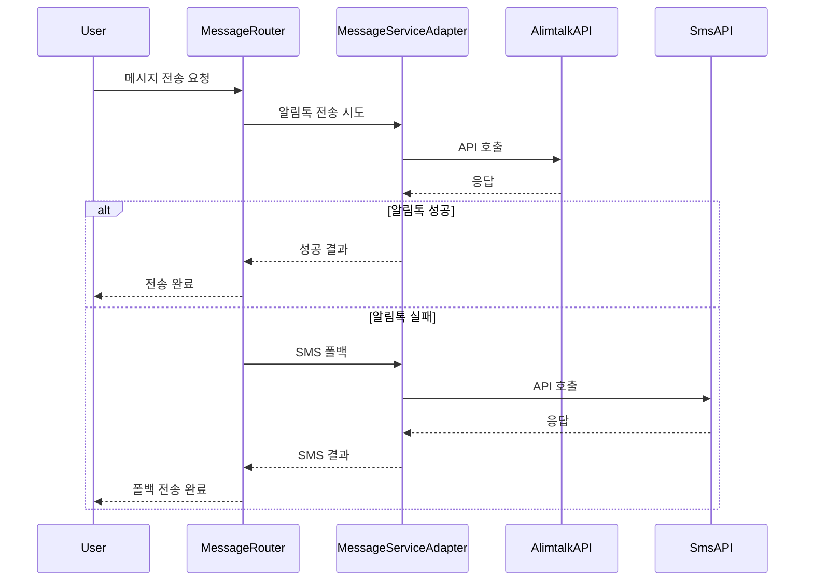

**구현 코드:**
```php
private function sendWithAlimtalkFirst(CreditMessage $creditMessage, array $recipients): array
{
    $siteId = $creditMessage->site_id;
    $metadata = $creditMessage->metadata ?? [];
    
    try {
        // 1. 알림톡 전송 시도
        if (isset($metadata['alimtalk_template_code'])) {
            $alimtalkResult = $this->messageAdapter->sendAlimtalk(
                $siteId,
                $recipients,
                $metadata['alimtalk_template_code'],
                $metadata['alimtalk_template_data'] ?? []
            );
            
            $this->updateCreditMessageAfterSend($creditMessage, $alimtalkResult);
            return [['method' => 'alimtalk', 'result' => $alimtalkResult]];
        }
    } catch (\Exception $e) {
        Log::warning("알림톡 전송 실패, SMS로 폴백", [
            'error' => $e->getMessage(),
            'credit_message_id' => $creditMessage->id
        ]);
    }

    // 2. SMS 폴백
    $smsResult = $this->messageAdapter->sendSms(
        $siteId,
        $recipients,
        $creditMessage->message_content,
        $metadata['sender_id'] ?? null
    );
    
    $this->updateCreditMessageAfterSend($creditMessage, $smsResult);
    return [['method' => 'sms_fallback', 'result' => $smsResult]];
}
```

#### 2.3.2 비용 최적화 전략 (cost_optimized)

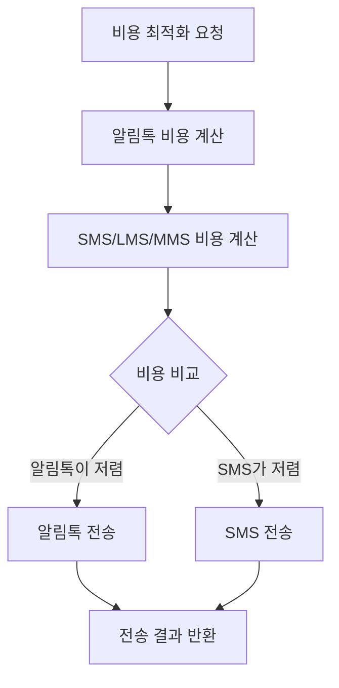

**구현 코드:**
```php
private function sendCostOptimized(CreditMessage $creditMessage, array $recipients): array
{
    $siteId = $creditMessage->site_id;
    $siteCredit = $this->creditManager->getSiteCredit($siteId);
    
    // 비용 비교
    $alimtalkCost = $siteCredit->getCostForMessageType('alimtalk') * count($recipients);
    $smsCost = $this->calculateSmsCost($creditMessage->message_content, count($recipients), $siteCredit);
    
    Log::info("비용 최적화 라우팅", [
        'credit_message_id' => $creditMessage->id,
        'alimtalk_cost' => $alimtalkCost,
        'sms_cost' => $smsCost
    ]);
    
    // 더 저렴한 방법 선택
    if ($alimtalkCost <= $smsCost) {
        return $this->sendWithAlimtalkFirst($creditMessage, $recipients);
    } else {
        return $this->sendSmsOnly($creditMessage, $recipients);
    }
}
```

## 3. 크레딧 관리 프로세스

### 3.1 크레딧 차감 프로세스

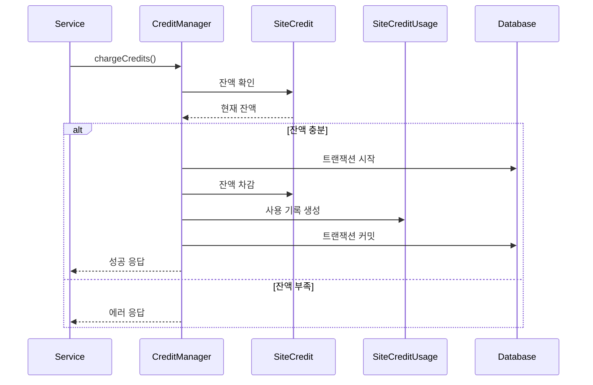

**구현 코드:**
```php
public function chargeCredits(string $siteId, string $messageType, int $quantity): SiteCreditUsage
{
    return DB::transaction(function () use ($siteId, $messageType, $quantity) {
        $siteCredit = $this->getSiteCredit($siteId);
        $costPerUnit = $siteCredit->getCostForMessageType($messageType);
        $totalCost = $costPerUnit * $quantity;
        
        // 잔액 확인
        if (!$siteCredit->hasEnoughBalance($totalCost)) {
            throw new InsufficientCreditsException("잔액이 부족합니다. 필요: {$totalCost}, 현재: {$siteCredit->balance}");
        }
        
        // 잔액 차감
        $siteCredit->decrement('balance', $totalCost);
        
        // 사용 기록 생성
        return SiteCreditUsage::create([
            'site_id' => $siteId,
            'message_type' => $messageType,
            'quantity' => $quantity,
            'cost_per_unit' => $costPerUnit,
            'total_cost' => $totalCost,
            'status' => 'charged',
            'metadata' => [
                'charged_at' => now(),
                'balance_before' => $siteCredit->balance + $totalCost,
                'balance_after' => $siteCredit->balance
            ]
        ]);
    });
}
```

### 3.2 자동 충전 프로세스

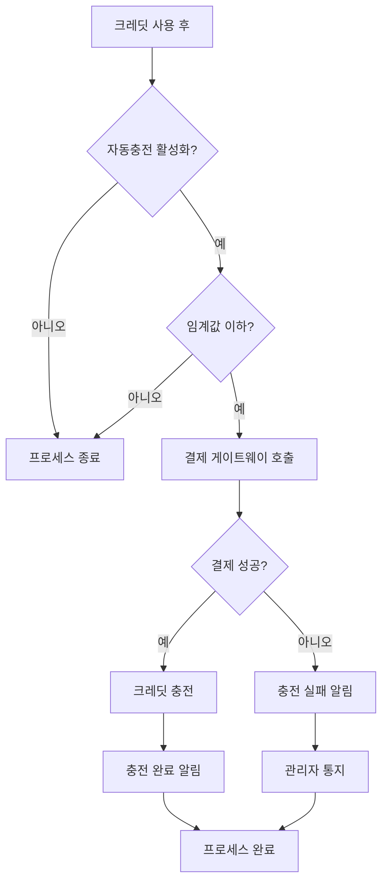

**구현 코드:**
```php
public function processAutoCharge(SiteCredit $siteCredit): bool
{
    if (!$siteCredit->shouldAutoCharge()) {
        return false;
    }
    
    try {
        // 결제 요청 생성
        $payment = SiteCreditPayment::create([
            'site_id' => $siteCredit->site_id,
            'amount' => $siteCredit->auto_charge_amount,
            'payment_method' => 'auto_charge',
            'status' => 'pending',
            'metadata' => [
                'auto_charge' => true,
                'triggered_at' => now(),
                'balance_before' => $siteCredit->balance
            ]
        ]);
        
        // 결제 게이트웨이 호출
        $paymentResult = $this->callPaymentGateway($payment);
        
        if ($paymentResult['success']) {
            // 성공 시 크레딧 충전
            return $this->completePayment($payment);
        } else {
            // 실패 시 상태 업데이트
            $payment->update(['status' => 'failed', 'error_message' => $paymentResult['error']]);
            return false;
        }
    } catch (\Exception $e) {
        Log::error("자동 충전 실패", [
            'site_id' => $siteCredit->site_id,
            'error' => $e->getMessage()
        ]);
        return false;
    }
}
```

### 3.3 환불 처리 프로세스

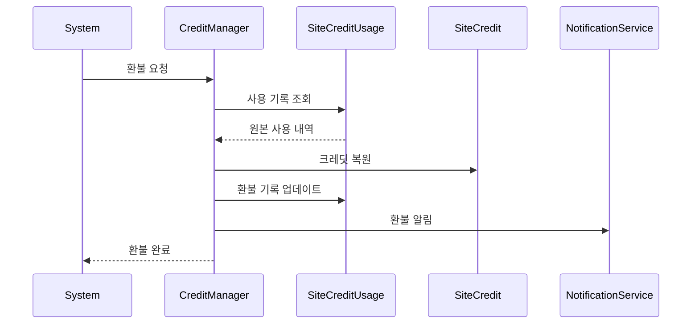

**구현 코드:**
```php
public function refundCredits(SiteCreditUsage $usage, float $amount, string $reason): bool
{
    return DB::transaction(function () use ($usage, $amount, $reason) {
        // 환불 가능 여부 확인
        $availableRefund = $usage->total_cost - ($usage->refund_amount ?? 0);
        if ($amount > $availableRefund) {
            throw new InvalidRefundException("환불 가능 금액을 초과했습니다.");
        }
        
        // 크레딧 복원
        $siteCredit = $this->getSiteCredit($usage->site_id);
        $siteCredit->increment('balance', $amount);
        
        // 환불 기록 업데이트
        $usage->update([
            'refund_amount' => ($usage->refund_amount ?? 0) + $amount,
            'refunded_at' => now(),
            'refund_reason' => $reason,
            'status' => ($usage->refund_amount + $amount >= $usage->total_cost) ? 'fully_refunded' : 'partially_refunded'
        ]);
        
        Log::info("크레딧 환불 완료", [
            'usage_id' => $usage->id,
            'site_id' => $usage->site_id,
            'refund_amount' => $amount,
            'reason' => $reason
        ]);
        
        return true;
    });
}
```

## 4. 예약 메시지 프로세스

### 4.1 예약 설정 프로세스

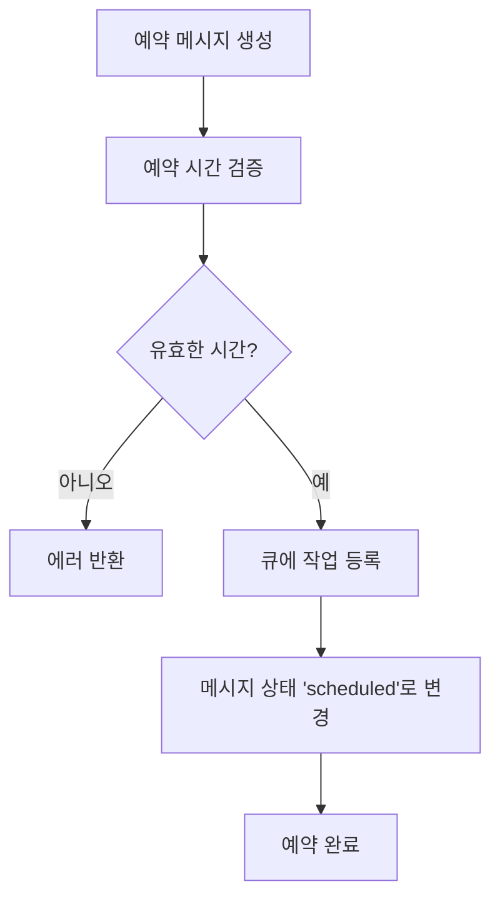

**구현 코드:**
```php
public function scheduleMessage(CreditMessage $creditMessage): void
{
    if ($creditMessage->scheduled_at && $creditMessage->scheduled_at->isFuture()) {
        // 스케줄된 시간이 미래인 경우 큐에 예약
        SendScheduledMessageJob::dispatch($creditMessage)
            ->delay($creditMessage->scheduled_at);
        
        $creditMessage->update(['status' => 'scheduled']);
        
        Log::info("메시지 전송 예약", [
            'credit_message_id' => $creditMessage->id,
            'scheduled_at' => $creditMessage->scheduled_at,
            'recipients' => count($creditMessage->recipients ?? [])
        ]);
    } else {
        // 즉시 전송
        $this->sendMessage($creditMessage);
    }
}
```

### 4.2 예약 메시지 실행 프로세스

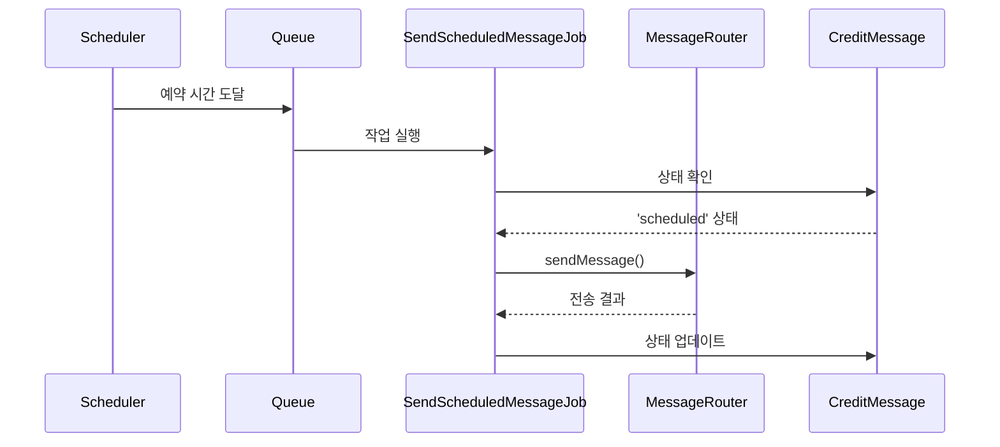

## 5. 웹훅 처리 프로세스

### 5.1 웹훅 수신 및 처리

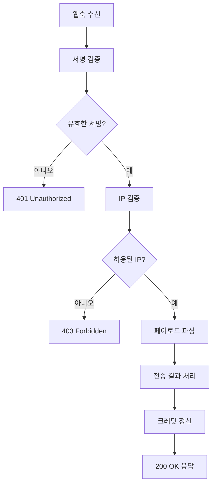

**구현 코드:**
```php
public function processWebhook(string $provider, array $payload): array
{
    try {
        // 페이로드에서 정보 추출
        $messageId = $this->extractMessageId($payload, $provider);
        $status = $this->extractStatus($payload, $provider);
        $errorCode = $this->extractErrorCode($payload, $provider);
        
        // 메시지 로그 찾기
        $sendLog = MessageSendLog::where('external_message_id', $messageId)->first();
        
        if (!$sendLog) {
            Log::warning("메시지 로그를 찾을 수 없음", ['message_id' => $messageId]);
            return ['status' => 'ignored', 'reason' => 'message_not_found'];
        }
        
        // 상태 업데이트
        $sendLog->update([
            'delivery_status' => $this->mapDeliveryStatus($status),
            'delivered_at' => $status === 'delivered' ? now() : null,
            'error_code' => $errorCode,
            'webhook_received_at' => now(),
            'webhook_payload' => $payload
        ]);
        
        // 실패한 경우 환불 처리
        if ($this->isFailedStatus($status)) {
            $this->processRefundForFailedMessage($sendLog);
        }
        
        return ['status' => 'processed', 'message_id' => $messageId];
    } catch (\Exception $e) {
        Log::error("웹훅 처리 실패", [
            'provider' => $provider,
            'payload' => $payload,
            'error' => $e->getMessage()
        ]);
        
        throw $e;
    }
}
```

## 6. 에러 처리 및 복구 프로세스

### 6.1 실패 처리 및 재시도

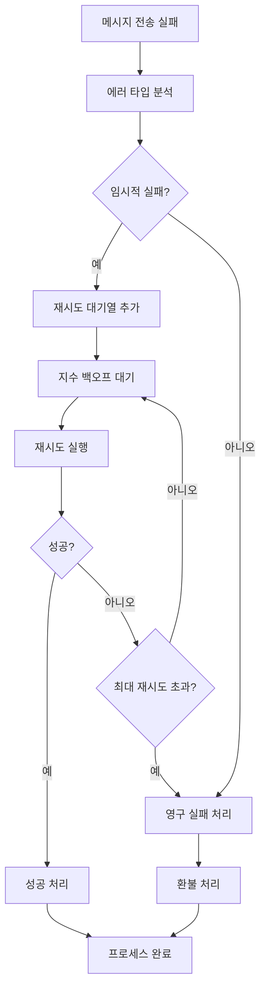

### 6.2 데이터 일관성 보장

```php
// 트랜잭션을 통한 데이터 일관성 보장
public function sendMessageWithConsistency(CreditMessage $creditMessage): array
{
    return DB::transaction(function () use ($creditMessage) {
        try {
            // 1. 크레딧 차감
            $usage = $this->creditManager->chargeCredits(
                $creditMessage->site_id,
                $creditMessage->message_type,
                count($creditMessage->recipients)
            );
            
            // 2. 메시지 전송
            $result = $this->sendMessage($creditMessage);
            
            // 3. 전송 로그 생성
            $this->createSendLogs($creditMessage, $result, $usage);
            
            return $result;
        } catch (\Exception $e) {
            // 트랜잭션 롤백으로 자동 복구
            Log::error("메시지 전송 실패로 트랜잭션 롤백", [
                'credit_message_id' => $creditMessage->id,
                'error' => $e->getMessage()
            ]);
            
            throw $e;
        }
    });
}
```

## 7. 모니터링 및 알림 프로세스

### 7.1 시스템 상태 모니터링

```php
// 헬스 체크 프로세스
class HealthCheckService
{
    public function checkSystemHealth(): array
    {
        $checks = [
            'database' => $this->checkDatabase(),
            'queue' => $this->checkQueue(),
            'external_apis' => $this->checkExternalAPIs(),
            'credit_balance' => $this->checkCriticalCreditLevels()
        ];
        
        $overallStatus = collect($checks)->every(fn($check) => $check['status'] === 'healthy') 
            ? 'healthy' : 'unhealthy';
        
        return [
            'overall_status' => $overallStatus,
            'timestamp' => now(),
            'checks' => $checks
        ];
    }
}
```

### 7.2 알림 프로세스

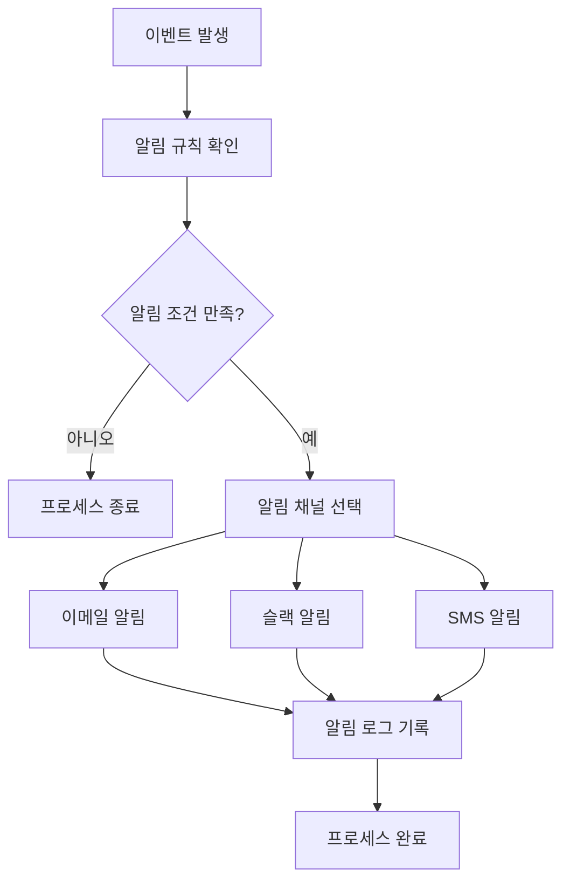

## 8. 성능 최적화 프로세스

### 8.1 배치 처리 프로세스

```php
// 대량 메시지 배치 처리
class BatchMessageProcessor
{
    public function processBatch(CreditMessage $creditMessage): void
    {
        $recipients = $creditMessage->recipients;
        $batchSize = config('credit-messaging.batch_size', 100);
        
        // 수신자를 배치 단위로 분할
        $batches = array_chunk($recipients, $batchSize);
        
        foreach ($batches as $index => $batch) {
            // 각 배치를 별도 작업으로 처리
            ProcessMessageBatchJob::dispatch($creditMessage, $batch, $index)
                ->onQueue('credit-messaging');
        }
    }
}
```

### 8.2 캐시 무효화 프로세스

```php
// 캐시 관리 프로세스
class CacheManager
{
    public function invalidateSiteCreditCache(string $siteId): void
    {
        $cacheKeys = [
            "site_credit:{$siteId}",
            "site_credit_stats:{$siteId}",
            "site_credit_balance:{$siteId}"
        ];
        
        foreach ($cacheKeys as $key) {
            Cache::forget($key);
        }
        
        Log::info("사이트 크레딧 캐시 무효화", ['site_id' => $siteId]);
    }
}
```

## 결론

Credit Messaging 시스템의 프로세스는 메시지 생성부터 전송, 정산, 모니터링까지 전체 생명주기를 체계적으로 관리합니다. 각 프로세스는 에러 처리, 트랜잭션 관리, 로깅을 통해 안정성을 보장하며, 비동기 처리와 배치 작업을 통해 확장성을 제공합니다. 이러한 프로세스 구조는 대용량 메시지 처리와 높은 가용성을 보장하는 견고한 메시징 플랫폼의 기반이 됩니다. 